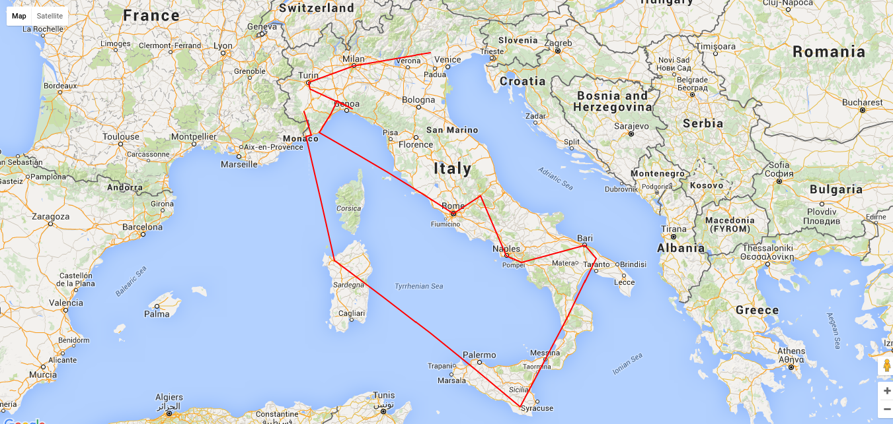

# TSP resolved with a genetic algorithm

This project is related to
[https://github.com/wdalmut/tsp-genetic-algorithm](https://github.com/wdalmut/tsp-genetic-algorithm)

This project is related to
[https://github.com/wdalmut/tsp-genetic-algorithm-2](https://github.com/wdalmut/tsp-genetic-algorithm-2)

This project is related to
[https://github.com/wdalmut/tsp-genetic-algorithm-3](https://github.com/wdalmut/tsp-genetic-algorithm-3)

This solution try to solve the tsp using a genetic algorithm.

In this attempt i use a gaussian distribution in order to select a population of
better solutions in order to optimize those solutions with mutations and recombinations.

The recombination algorithm uses a one-point crossover strategy. The point for
crossover is computed with a random strategy (uniform distribution)

Here is a result example (5000 generations):

